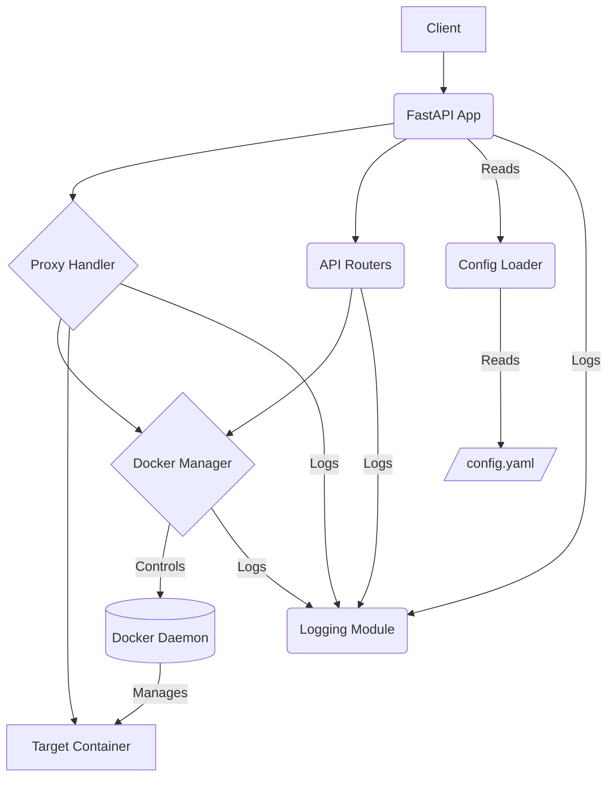
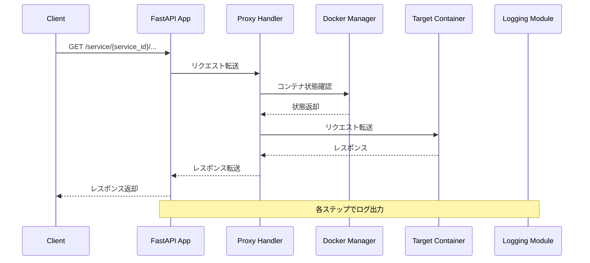
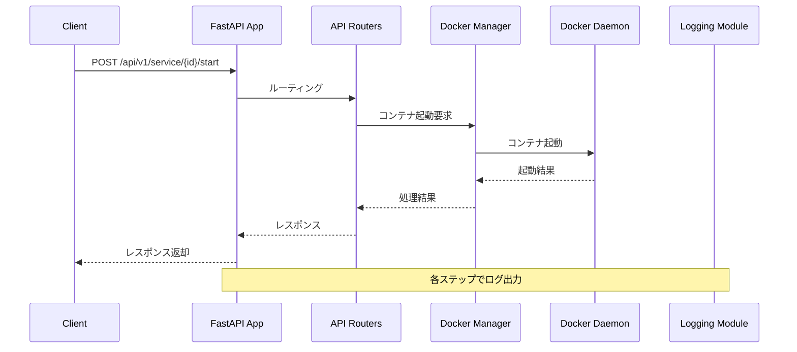
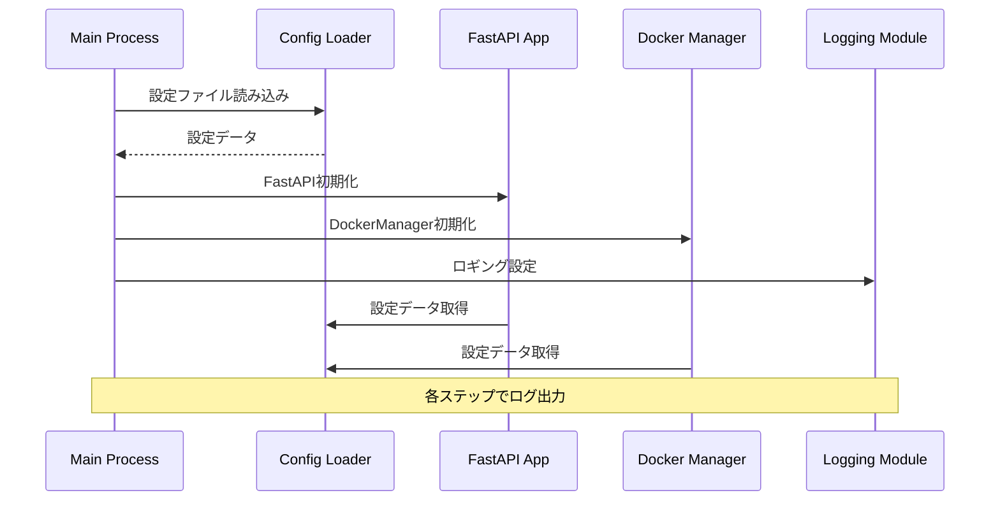

# プロジェクト計画: AI推論プロキシサーバー

## フェーズ2: 設計

**目的:**
【解説】このフェーズでは、フェーズ1「要求分析」で定義した機能要求・非機能要求を実現するための具体的な実装計画を立てます。システムの全体構造（アーキテクチャ）、APIの詳細、データの扱い方（データモデル）、主要なロジック（コンテナ管理など）、そして品質を確保するためのテスト戦略などを設計します。ここでの設計が、続くフェーズ3「開発」の設計図となります。

**想定期間:**
【解説】アーキテクチャ、API、データモデル、主要ロジック、テスト戦略の設計にかかる期間を見積もります。MVPスコープであれば、1週〜1.5週間程度が目安です。
【記入例】`{{1週}}`

---

### 1. アーキテクチャ設計

**【解説】**
システム全体の構成要素と、それらがどのように連携するかを定義します。これにより、システムの見通しが良くなり、各コンポーネントの役割分担が明確になります。

* **主要コンポーネント:**
  * **FastAPI Application:** Webフレームワーク。APIエンドポイントの定義、リクエスト/レスポンス処理を担当。
  * **Config Loader:** 設定ファイル(`config.yaml`)を読み込み、バリデーションし、内部データ構造に変換するモジュール。(FR-01)
  * **Docker Manager:** Dockerデーモンと通信し、コンテナのライフサイクル（起動、停止、状態取得）を管理するクラス/モジュール。(FR-03, FR-04, FR-05)
  * **Proxy Handler:** `/service/...` へのリクエストを受け取り、対応するコンテナに転送するロジック。(FR-02)
  * **API Router(s):** 管理用API (`/api/v1/...`) のエンドポイントを定義するルーター。
  * **Logging Module:** `loguru` を設定し、システム全体からのログ出力を担当。(FR-06)

* **コンポーネント図:**



* **リクエストフロー図:**

**1. プロキシリクエストフロー:**



**2. APIリクエストフロー:**



**3. サーバー起動フロー:**



* **技術選択の根拠:**
  * **FastAPI:** 非同期処理、Pydantic連携による型安全な開発、自動APIドキュメント生成。APIサーバーとプロキシ機能の実装に適している。
  * **Docker SDK for Python:** PythonからDockerデーモンを操作するための公式ライブラリ。コンテナ管理ロジックの実装に直接的で適している。
  * **Loguru:** 設定が容易で高機能なロギングライブラリ。開発初期からのログ導入に適している。
  * **Pydantic:** 設定ファイルのバリデーション(FR-01)、APIのリクエスト/レスポンスモデル定義(API設計)に活用。
  * **uv:** 高速なPythonパッケージインストーラーおよび仮想環境管理ツール。開発効率向上。
  * **OpenTelemetry:** ログ、トレース、メトリクスの収集。
  * **click:** コマンドラインインターフェースの作成。
  * **rich, richuru:** コンソール出力のフォーマット。
  * **pytest:** テストフレームワーク。
  * **pytest-cov:** コードカバレッジの計測。
  * **pytest-asyncio:** 非同期テストのサポート。
  * **pytest-mock:** テストダブルのサポート。
  * **pytest-cov:** コードカバレッジの計測。
  * **xdoctest:** ドキュメントのテスト。

---

### 2. API設計 (詳細)

**【解説】**
フェーズ1で定義したAPIエンドポイントについて、リクエスト/レスポンスの具体的なデータ形式（JSONスキーマ）、使用するHTTPステータスコード、エラーハンドリングの詳細を定義します。Pydanticモデルを活用して、型安全な実装とドキュメント自動生成を目指します。

* **共通エラーレスポンス:**
  * 【解説】API全体で共通のエラーレスポンス形式を定義します。
  * 【記入例】

```python
        # Pydanticモデル例
        from pydantic import BaseModel

        class ErrorDetail(BaseModel):
            detail: str

        # 404 Not Found: ErrorDetail(detail="Service 'unknown_service' not found")
        # 500 Internal Server Error: ErrorDetail(detail="Failed to stop container: Docker API error")
        # 400 Bad Request (バリデーションエラーなど): FastAPI/Pydanticのデフォルトを利用 or カスタマイズ
```

* **`/service/{service_id}/{path:path}` (プロキシ)** (FR-02)
  * **メソッド:** `GET, POST, PUT, DELETE, ...` (任意)
  * **パスパラメータ:**
    * `service_id`: `str` - 転送先のサービスID。
    * `path`: `str` - 転送先コンテナ内のパス。
  * **リクエストボディ:** `Any` (転送するため定義不要)
  * **成功レスポンス:**
    * ステータスコード: バックエンドコンテナの応答に依存。
    * ボディ: バックエンドコンテナの応答に依存。
  * **エラーレスポンス:**
    * `404 Not Found`: `service_id` が設定に存在しない場合。(`ErrorDetail`)
    * `503 Service Unavailable`: コンテナが実行中でない場合。(`ErrorDetail`)
    * `502 Bad Gateway`: バックエンドコンテナへの接続失敗時。(`ErrorDetail`)

* **`POST /api/v1/service/{service_id}/start`** (FR-03)

  * **パスパラメータ:**
    * `service_id`: `str` - 起動するサービスID。
  * **リクエストボディ:** なし
  * **成功レスポンス:**
    * `200 OK` または `202 Accepted`: 起動処理を開始した場合。

  * **エラーレスポンス:**
    * `404 Not Found`: `service_id` が設定に存在しない場合。(`ErrorDetail`)
    * `409 Conflict`: コンテナが既に実行中の場合（冪等性を考慮し、エラーではなく成功メッセージに含める方針も可）。
    * `500 Internal Server Error`: Docker操作に失敗した場合。(`ErrorDetail`)

```python
class StartResponse(BaseModel):
    message: str # 例: "Container 'llama3' starting" or "Container 'llama3' already running"
```

* **`POST /api/v1/service/{service_id}/stop`** (FR-04)
  * **パスパラメータ:**
    * `service_id`: `str` - 停止するサービスID。
  * **リクエストボディ:** なし
  * **成功レスポンス:**
    * `200 OK`: 停止処理が成功した場合（または既に停止していた場合）。

  * **エラーレスポンス:**
    * `404 Not Found`: `service_id` が設定に存在しない場合。(`ErrorDetail`)
    * `500 Internal Server Error`: Docker操作に失敗した場合。(`ErrorDetail`)

```python
class StopResponse(BaseModel):
    message: str # 例: "Container 'llama3' stopped" or "Container 'llama3' not found or already stopped"
```

* **`GET /api/v1/container/{service_id}`** (FR-05)
  * **パスパラメータ:**
    * `service_id`: `str` - 状態を取得するサービスID。
  * **リクエストボディ:** なし
  * **成功レスポンス:**
    * `200 OK`:

  * **エラーレスポンス:**
    * `404 Not Found`: `service_id` が設定に存在しない場合。(`ErrorDetail`)
    * `500 Internal Server Error`: Docker状態取得に失敗した場合。(`ErrorDetail`)

```python
from typing import Literal

class ContainerStatusResponse(BaseModel):
    service_id: str
    status: Literal["running", "exited", "starting", "stopping", "not_found", "error"] # より詳細な状態
```

* **OpenAPIドキュメント:**
  * 【解説】FastAPIの自動生成機能を利用し、API仕様をドキュメント化します。
  * **方針:** Pydanticモデルを適切に定義することで、`/docs` や `/redoc` で参照可能なドキュメントを自動生成する。各エンドポイントやモデルに説明 (`description`, `summary`) を追加する。

---

### 3. データモデル設計

**【解説】**
システムが扱う主要なデータの構造を定義します。特に、設定ファイルのスキーマと、システム内部で管理するコンテナの状態情報が重要です。ここでもPydanticを活用します。

* **設定ファイルスキーマ (`config.yaml`)** (FR-01)
  * 【解説】`config.yaml` の構造をPydanticモデルで詳細に定義します。これにより、読み込み時のバリデーションと型安全性が保証されます。
  * 【記入例】

```python
from pydantic import BaseModel, Field, PositiveInt, FilePath, DirectoryPath
from typing import List, Dict, Optional

class ServerConfig(BaseModel):
    host: str = "0.0.0.0"
    port: PositiveInt = 11000
    version: str = "v1"

class ResourceRequirements(BaseModel):
    min_memory_mb: Optional[PositiveInt] = None # MVPでは使用しないが定義
    vram_required_mb: Optional[PositiveInt] = None # MVPでは使用しないが定義

class ServiceConfig(BaseModel):
    type: Literal["llama-cpp-server"] # MVPでは固定
    port: PositiveInt
    image: str # Dockerイメージ名
    resource_requirements: Optional[ResourceRequirements] = None
    volumes: Optional[List[str]] = None # 例: ["/host/path:/container/path"]
    args: Optional[List[str]] = None # コンテナ起動引数
    gpus: Optional[Literal["all"]] = "all" # NVIDIA GPU利用設定 (NoneならGPUなし)

class Config(BaseModel):
    server: ServerConfig
    services: Dict[str, ServiceConfig] # キーが service_id

# 利用例:
# config_data = yaml.safe_load(open("config.yaml"))
# config = Config(**config_data)
```

* **内部状態データモデル:**
  * 【解説】プロキシサーバーが実行中にメモリ内で保持する必要がある情報（主に各サービスのコンテナ状態）の構造を定義します。
  * 【記入例】

```python
        from enum import Enum

        class ServiceStatus(str, Enum):
            STOPPED = "stopped"
            STARTING = "starting"
            RUNNING = "running"
            STOPPING = "stopping"
            ERROR = "error"

        class ServiceState(BaseModel):
            service_id: str
            config: ServiceConfig # 対応する設定
            status: ServiceStatus = ServiceStatus.STOPPED
            container_id: Optional[str] = None # 実行中のコンテナID
            last_error: Optional[str] = None # 直近のエラーメッセージ

        # 管理方法:
        # FastAPIアプリのライフサイクル(startup/shutdown)で初期化/クリーンアップ
        # Dict[str, ServiceState] の形式でメモリ上に保持 (シングルトンクラスやグローバル変数など)
        # スレッドセーフ/非同期アクセスに注意が必要な場合はロック機構を検討
        # ```python
        # service_states: Dict[str, ServiceState] = {}
        # state_lock = asyncio.Lock() # 非同期処理の場合
        # ```
```

---

### 4. コンテナ管理ロジック設計

**【解説】**
`Docker Manager` コンポーネントが、Docker SDK for Python を使用してコンテナをどのように操作するかの詳細なロジックを設計します。エラーハンドリングも重要な要素です。

* **DockerManagerクラス/モジュール:**
  * 【解説】コンテナ操作ロジックをカプセル化するクラスまたはモジュールのインターフェース（メソッド）を定義します。
  * 【記入例】

```python
        import docker
        from docker.models.containers import Container
        from docker.types import DeviceRequest

        class DockerManager:
            def __init__(self):
                try:
                    self.client = docker.from_env()
                    # TODO: Dockerデーモン疎通確認
                except docker.errors.DockerException as e:
                    # TODO: 初期化失敗時のエラーハンドリング、ログ出力
                    raise RuntimeError(f"Failed to connect to Docker daemon: {e}") from e

            async def start_container(self, service_id: str, config: ServiceConfig) -> Container:
                # TODO: 冪等性チェック (既に同名のコンテナが存在するか？)
                # TODO: ポート、ボリューム、GPU設定の組み立て
                # TODO: client.containers.run() の呼び出し (detach=True)
                # TODO: docker.errors 系例外のハンドリング (NotFound, APIError)
                # TODO: 起動成功/失敗のログ出力 (FR-06)
                # 例: GPU設定
                device_requests = []
                if config.gpus == "all":
                    device_requests.append(DeviceRequest(count=-1, capabilities=[['gpu']]))

                container_name = f"ai-proxy-{service_id}"
                try:
                    container = self.client.containers.run(
                        image=config.image,
                        command=config.args,
                        ports={f"{config.port}/tcp": config.port}, # コンテナポートとホストポートを同一に
                        volumes=self._parse_volumes(config.volumes),
                        name=container_name,
                        detach=True,
                        remove=True, # 停止時に自動削除 (挙動確認)
                        device_requests=device_requests,
                        # restart_policy={"Name": "no"}, # 自動再起動はしない
                    )
                    # TODO: 起動中の状態を内部状態モデルに反映 (STARTING -> RUNNING)
                    return container
                except docker.errors.ImageNotFound:
                     # TODO: エラーハンドリング、ログ
                     raise
                except docker.errors.APIError as e:
                     # TODO: エラーハンドリング (ポート衝突など)、ログ
                     raise

            async def stop_container(self, container_id: str):
                # TODO: コンテナIDでコンテナオブジェクトを取得 (client.containers.get)
                # TODO: コンテナが見つからない場合の処理 (NotFound 例外)
                # TODO: container.stop() の呼び出し
                # TODO: container.remove() の呼び出し (runでremove=Trueなら不要かも)
                # TODO: docker.errors 系例外のハンドリング
                # TODO: 停止成功/失敗のログ出力 (FR-06)
                # TODO: 停止後の状態を内部状態モデルに反映 (STOPPING -> STOPPED)
                try:
                    container = self.client.containers.get(container_id)
                    container.stop()
                    # container.remove() # runでremove=Trueなら不要かも
                except docker.errors.NotFound:
                    # TODO: 冪等性考慮、ログ
                    pass
                except docker.errors.APIError as e:
                    # TODO: エラーハンドリング、ログ
                    raise

            async def get_container_status(self, container_id: str) -> Optional[str]:
                # TODO: コンテナIDでコンテナオブジェクトを取得
                # TODO: container.status の取得
                # TODO: NotFound時の処理
                try:
                    container = self.client.containers.get(container_id)
                    container.reload() # 最新の状態を取得
                    return container.status # "running", "exited", etc.
                except docker.errors.NotFound:
                    return None
                except docker.errors.APIError as e:
                    # TODO: エラーハンドリング、ログ
                    raise

            def _parse_volumes(self, volumes_config: Optional[List[str]]) -> Optional[Dict[str, Dict]]:
                # "host:container:mode" 形式を Docker SDK の形式に変換
                if not volumes_config:
                    return None
                parsed = {}
                for vol in volumes_config:
                    parts = vol.split(':')
                    if len(parts) == 2:
                        parsed[parts[0]] = {'bind': parts[1], 'mode': 'rw'} # default mode rw
                    elif len(parts) == 3:
                        parsed[parts[0]] = {'bind': parts[1], 'mode': parts[2]}
                    else:
                        # TODO: 不正なボリューム定義のエラー処理、ログ
                        print(f"WARN: Invalid volume format: {vol}") # 仮
                return parsed

        # 利用方法: DockerManagerインスタンスをシングルトンとして管理
        # docker_manager = DockerManager()
```

* **エラーハンドリング:**
  * 【解説】Docker操作中に発生しうる主要なエラーと、その対処方針を定義します。
  * 【記入例】
    * `docker.errors.DockerException`: Dockerデーモン接続失敗 → サーバー起動失敗。
    * `docker.errors.ImageNotFound`: コンテナ起動時に指定イメージが見つからない → 起動APIで`500 Internal Server Error`、エラーログ出力。
    * `docker.errors.NotFound`: 停止/状態取得時にコンテナが見つからない → 冪等性を考慮し、ログ出力のみ or 成功として扱う。
    * `docker.errors.APIError`: ポートの衝突、不正なパラメータなど → APIで`500 Internal Server Error`、エラー詳細をログ出力。
    * コンテナ起動後のヘルスチェックはMVPスコープ外だが、将来的に実装する場合、タイムアウトや失敗時の状態遷移（`ERROR`状態など）を考慮。

---

### 5. モニタリング・ロギング設計 (詳細)

**【解説】**
フェーズ1で定義した基本的なログ出力(FR-06)について、`loguru` の具体的な設定やログフォーマット、出力するログの内容を詳細化します。MVPスコープ外ですが、将来的なOpenTelemetry連携も見据えた設計を意識します。

* **Loguru設定:**
  * 【解説】`loguru` の初期設定を行います。ログレベル、フォーマット、出力先（シンク）などを定義します。
  * 【記入例】

```python
        import sys
        from loguru import logger

        def setup_logging():
            logger.remove() # デフォルトのハンドラを削除
            log_format = (
                "<green>{time:YYYY-MM-DD HH:mm:ss.SSS}</green> | "
                "<level>{level: <8}</level> | "
                "<cyan>{name}</cyan>:<cyan>{function}</cyan>:<cyan>{line}</cyan> - <level>{message}</level>"
            )
            # コンソール出力 (INFOレベル以上)
            logger.add(sys.stderr, level="INFO", format=log_format, colorize=True)
            # (任意) デバッグ用ファイル出力 (DEBUGレベル以上)
            # logger.add("logs/debug_{time}.log", level="DEBUG", rotation="1 day", retention="7 days")

            # FastAPIの uvicorn のログも loguru で受け取る設定 (任意)
            # import logging
            # class InterceptHandler(logging.Handler):
            #     def emit(self, record):
            #         # logger_opt = logger.opt(depth=6, exception=record.exc_info)
            #         logger_opt = logger.opt(exception=record.exc_info)
            #         logger_opt.log(record.levelname, record.getMessage())
            # logging.getLogger("uvicorn").handlers = [InterceptHandler()]
            # logging.getLogger("uvicorn.access").handlers = [InterceptHandler()]

        # main.py などで setup_logging() を呼び出す
```

* **ログ出力箇所とレベル:**
  * 【解説】どの処理で、どのレベル（DEBUG, INFO, WARNING, ERROR, CRITICAL）のログを出力するかを具体的に定義します。
  * 【記入例】
    * `INFO`: サーバー起動/停止、設定読み込み完了、APIリクエスト受信（主要なもの）、コンテナ起動/停止操作の開始/完了。
    * `DEBUG`: 詳細なAPIリクエスト情報（ヘッダーなど）、プロキシ転送の詳細、Docker SDK呼び出しの詳細。
    * `WARNING`: 軽微な問題、予期しないが処理は続行可能な状況（例: 設定の一部がデフォルト値にフォールバック）。
    * `ERROR`:
      * 処理が失敗したエラー（APIエラーレスポンスを返す場合）、Docker操作の失敗。
      * ユーザー要因のエラー（例: 設定ファイルのバリデーションに失敗した場合）。
    * `CRITICAL`:
      * サーバーが続行不可能な致命的なエラー（例: Dockerデーモン接続不可）。
      * 想定していないロジックの実行（不変条件の破壊）。

* **OpenTelemetry連携 (MVPスコープ外の構想):**
  * 【解説】将来的にOpenTelemetryを導入する場合の構想を記述します。
  * 【記入例】
    * `Traces`: FastAPIミドルウェアでリクエストトレースを自動計装。`DockerManager` のメソッド呼び出しなどを手動でスパンに追加。
    * `Metrics`: リクエスト数、レイテンシ、エラー数、アクティブなコンテナ数、(将来的に)リソース使用量などを計装。
    * `Logs`: `loguru` のシンクとしてOpenTelemetry Log Exporterを設定し、SigNozにログを転送する。Trace IDやSpan IDをログレコードに含める。

---

### 6. テスト戦略

**【解説】**
開発するソフトウェアの品質を保証するためのテスト計画を立てます。どのような種類のテスト（ユニット、結合、E2E）を、どのツールを使って、どのように行うかを定義します。

* **テストの種類と範囲:**
  * 【解説】実施するテストの種類と、それぞれのテストでカバーする範囲を定義します。
  * 【記入例】
    * **ユニットテスト:**
      * 対象:
        * `Config Loader` (YAMLパース、バリデーション)
        * `Docker Manager` の各メソッド（Docker SDKはモック化）
        * プロキシハンドラのロジック部分
        * APIエンドポイントのロジック部分（FastAPI TestClient利用）
      * 目的: 各コンポーネントが単体で正しく動作することを確認する。
    * **結合テスト:**
      * 対象:
        * APIエンドポイント呼び出しから `Docker Manager` を経由した実際のDocker操作（コンテナ起動/停止/状態確認）までの一連の流れ。
        * プロキシ機能のテスト（実際にコンテナを起動し、リクエストが転送されるか）。
      * 目的: コンポーネント間の連携が正しく動作することを確認する。
    * **E2Eテスト (End-to-End):**
      * MVPでは必須ではないが、将来的に検討。実際にサーバーを起動し、`curl` やスクリプトでAPIを叩き、期待通りの動作をするか確認する。
      * ユーザーストーリーに基づくE2Eテストを検討。
  
* **テストツール:**
  * 【解説】テストに使用するライブラリやフレームワークをリストアップします。
  * 【記入例】
    * `pytest`: テストフレームワーク。
    * `pytest-asyncio`: 非同期コードのテスト用。
    * `httpx`: FastAPI TestClientの内部で使用。API呼び出しのテスト。
    * `pytest-mock`: Docker SDKなどの外部依存をモック化するため。
    * `(任意)` `testcontainers-python`: 結合テスト用に、テスト実行時にDockerコンテナ（例: テスト用のDockerデーモンや偽のバックエンドサービス）を起動・管理するため。

* **テスト実行方針:**
  * 【解説】テストをいつ、どのように実行するかの方針を定めます。
  * 【記入例】
    * 開発者は、機能実装と同時に対応するユニットテストを作成する。
    * Pull Request作成前に、ローカルで全てのテストがパスすることを確認する。
    * `(任意)` GitHub ActionsなどのCIツールを導入し、Push時やPull Request時に自動でテストを実行する。
    * テストコードも通常のコードと同様にレビュー対象とする。

* **Dockerデーモンとのテスト:**
  * 【解説】Dockerデーモンへの依存をどのように扱うか、具体的な戦略を記述します。
  * 【記入例】
    * **ユニットテスト:** `pytest-mock` を使用し、`docker.from_env()` や `client.containers.run()` などのDocker SDKのメソッド呼び出しをモック化する。これにより、Dockerデーモンが不要なテストを実行できる。
    * **結合テスト:**
      * **方法1 (推奨):** ローカルまたはCI環境のDockerデーモンを直接利用する。テスト実行前に環境が整っている必要がある。テストで作成したコンテナは、テスト終了時に確実にクリーンアップする (`pytest` の fixture を活用)。
      * **方法2:** `testcontainers-python` を利用して、テスト実行時に一時的なDocker環境を構築する。
